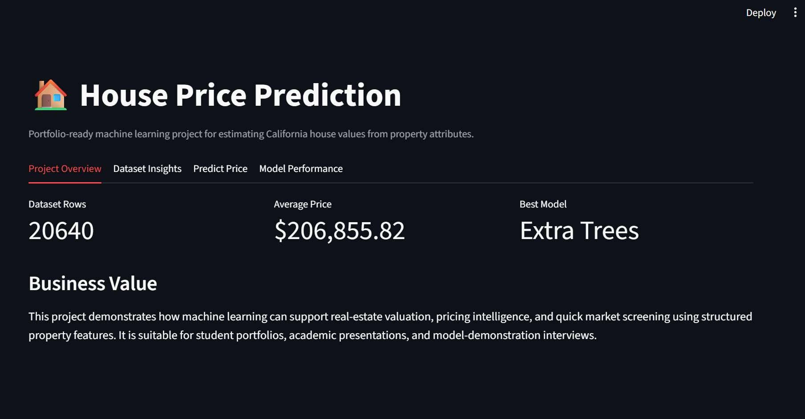
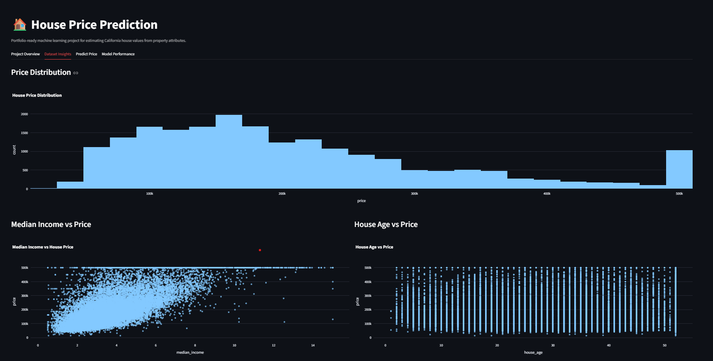
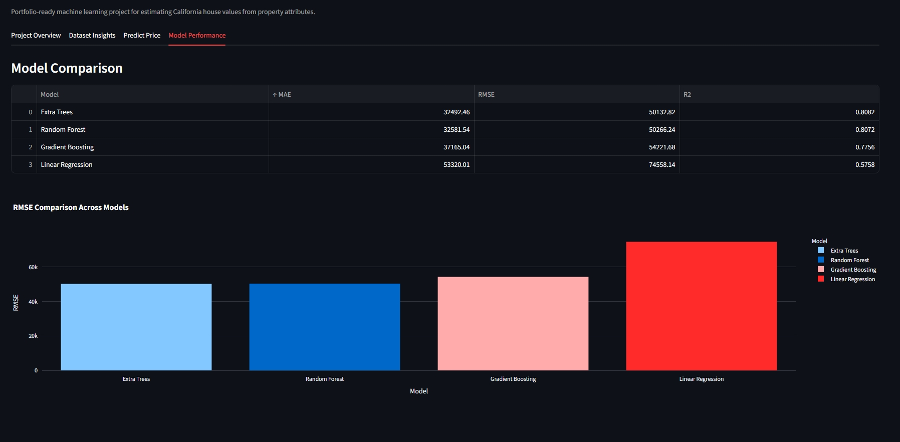
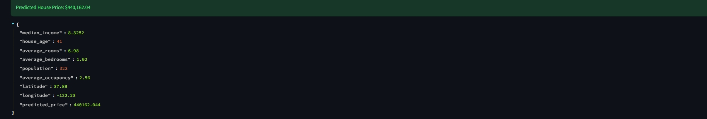

# House Price Prediction

This project builds a machine learning regression system to estimate residential property prices in California using a real public housing dataset. The workflow loads the source data, normalizes it into a consistent schema, trains and compares several regression models, selects the best-performing model, and exposes the prediction workflow through a Streamlit dashboard for portfolio-style demonstration.

## Overview

House price prediction is a classic supervised learning problem with strong practical value in real-estate valuation, market analysis, and decision support. This project addresses that problem by using a real housing dataset from scikit-learn and training multiple regression models to estimate a home price from property features such as median income, house age, room counts, occupancy, and geographic location.

The application predicts the estimated price of a property based on user-entered house characteristics and allows the user to compare model performance using a set of standard regression metrics. The result is a clean end-to-end ML portfolio project that is easy to explain during academic or interview presentations.

## 📸 Project Screenshots

### 🏠 Project Overview

The dashboard provides a high-level overview of the California Housing dataset and highlights the best-performing machine learning model.



---

### 📊 Dataset Insights

Interactive visualizations explore house-price distribution and relationships between important property features and house prices.



---

### 🤖 Model Performance

Multiple regression models are evaluated using MAE, RMSE, and R² to identify the best-performing approach.



**Best Model:** Extra Trees Regressor
**R²:** 0.8082
**RMSE:** $50,132.82
**MAE:** $32,492.46

---

### 🎯 House Price Prediction

The application accepts property attributes and uses the trained machine learning model to estimate the house price.



**Example Prediction:** **$440,162.04**


## Features

The project currently includes the following implemented features:

- Real California Housing dataset loading through scikit-learn
- Automatic dataset creation and persistence to `data/house_data.csv`
- Column normalization into a consistent final schema for training and prediction
- Training and comparison of four regression models
- Model saving and metadata export
- Streamlit-based prediction interface for user-entered property values
- Plotly charts for data exploration and model comparison
- Automated validation tests for dataset normalization and model training pipeline

## Dataset

This project uses the California Housing dataset from the scikit-learn library.

- Source: scikit-learn `fetch_california_housing`
- Official dataset reference: https://scikit-learn.org/stable/modules/generated/sklearn.datasets.fetch_california_housing.html
- Dataset size: 20,640 rows and 8 input features plus the target variable
- Target variable: `price`
- Final feature schema used by this project:
  - `median_income`
  - `house_age`
  - `average_rooms`
  - `average_bedrooms`
  - `population`
  - `average_occupancy`
  - `latitude`
  - `longitude`
  - `price` (target)

### Data preprocessing performed

The actual implementation includes the following steps:

- Loading the California Housing dataset from scikit-learn
- Renaming source feature columns into the project schema
- Scaling the target variable from the original dataset encoding into U.S. dollar values by multiplying by `100_000`
- Validating required columns before training or prediction
- Writing the final normalized dataset to `data/house_data.csv`
- Preparing numeric features for model training using median imputation and scaling
- Training all models using the same feature order and preprocessing pipeline

## Machine Learning Workflow

The current project follows this real workflow:

Dataset
↓
Data Loading and Validation
↓
Column Normalization and Target Scaling
↓
Feature Preparation and Preprocessing
↓
Train/Test Split
↓
Model Training
↓
Model Comparison
↓
Best Model Selection
↓
Prediction Application

## Models

The project trains and compares the following models:

- Linear Regression
- Random Forest Regressor
- Gradient Boosting Regressor
- Extra Trees Regressor

## Model Evaluation

The actual evaluation metrics are stored in `models/model_comparison.csv` and are as follows:

| Model | MAE | RMSE | R² |
| --- | ---: | ---: | ---: |
| Extra Trees | 32492.4635 | 50132.8169 | 0.8082 |
| Random Forest | 32581.5414 | 50266.2381 | 0.8072 |
| Gradient Boosting | 37165.0448 | 54221.6758 | 0.7756 |
| Linear Regression | 53320.0130 | 74558.1383 | 0.5758 |

The best-performing model in the current project is: Extra Trees Regressor.

## Application

The project includes a Streamlit dashboard that offers:

- a project overview panel
- dataset statistics and visual analysis
- a prediction form for entering housing features
- a model-comparison view with metrics and RMSE bar chart

The prediction interface accepts the following inputs:

- median income
- house age
- average rooms
- average bedrooms
- population
- average occupancy
- latitude
- longitude

The app then outputs the predicted house price in dollars.

## Project Structure

```text
house prediction/
├── .gitignore
├── README.md
├── app.py
├── meta
├── meta.bat
├── requirements.txt
├── data/
│   └── house_data.csv
├── models/
│   ├── best_house_model.pkl
│   ├── model_comparison.csv
│   └── model_metadata.json
├── src/
│   ├── __init__.py
│   ├── data_utils.py
│   └── training.py
├── tests/
│   └── test_pipeline.py
└── .venv/     # local environment, excluded from Git
```

## Installation

Create and activate a virtual environment, then install the project requirements:

```bash
python -m venv .venv
.venv\Scripts\activate
python -m pip install --upgrade pip
python -m pip install -r requirements.txt
```

## Running the Project

### 1. Train the model

```bash
python -m src.training
```

This loads the dataset, trains the models, saves the comparison file, and writes the best model to `models/best_house_model.pkl`.

### 2. Start the Streamlit app

```bash
streamlit run app.py --server.headless true --server.address 127.0.0.1 --server.port 8501
```

If port 8501 is unavailable, use another port such as:

```bash
streamlit run app.py --server.headless true --server.address 127.0.0.1 --server.port 8502
```

## Example Usage

A user enters housing information such as median income, local house age, room counts, occupancy, and geographic coordinates into the Streamlit form. The app then passes that data to the trained model and returns an estimated property price in dollars.

## Testing

The project includes automated validation tests in `tests/test_pipeline.py`.

Current tests cover:

- normalization of the real California housing dataset into the project schema
- training pipeline execution and successful model artifact generation

Command used for verification:

```bash
python -m unittest discover -s tests -q
```

## Limitations

This project is a solid portfolio demonstration, but it still has limitations:

- It uses a single public dataset and does not include broader geographic or temporal market data
- No advanced hyperparameter optimization is currently implemented
- There is no external API or deployment layer yet
- The project does not include explainability tooling or monitoring

## Future Improvements

Planned future enhancements for a more advanced portfolio version include:

- SHAP or model explainability analysis
- Hyperparameter tuning using cross-validation
- FastAPI backend for programmatic predictions
- Deployment to a cloud platform or hosting service
- Integration of richer housing or market datasets
- Monitoring and retraining workflows for production deployment
- Improved validation strategies and feature engineering exploration

## Technologies

- Python
- Streamlit
- Pandas
- NumPy
- Scikit-learn
- Plotly
- Joblib
- unittest

## Author / Project Information

This project is prepared as a student portfolio and machine learning demonstration project focused on real-world house price estimation using a public dataset. It is intended for academic, interview, and recruitment presentation.

## GitHub Safety Note

The trained model file is kept locally for prediction and app execution, but it is excluded from Git to avoid committing large generated artifacts. The model is intentionally not uploaded to GitHub automatically.
